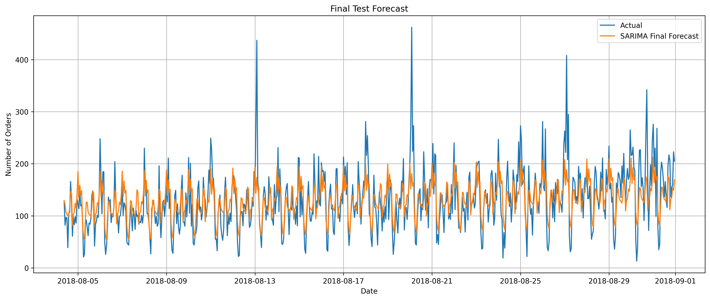

# 🚕 Time Series Forecasting: Hourly Taxi Order Prediction for Sweet Lift

## 📌 Project Overview
This project focuses on building a time series model to **forecast hourly taxi orders** using historical data provided by Sweet Lift, a taxi company. The primary goal is to **optimize driver allocation** by predicting the number of rides one hour in advance—ensuring operational efficiency and reduced customer wait times.

---

## 🧠 Objective
Sweet Lift experiences fluctuations in customer demand throughout the day. By forecasting hourly taxi orders with a required RMSE below 48, this project empowers the company to:

- Increase driver availability during peak hours  
- Decrease idle time during low demand  
- Improve customer satisfaction and profitability

---

## 🔧 What Was Done (Methodology & Techniques)

- **Data Preprocessing**:  
  Resampled raw time series data to hourly intervals and handled missing values.

- **Time Series Decomposition**:  
  Analyzed **trend**, **seasonality**, and **residuals** to understand temporal behavior.

- **Stationarity Testing**:  
  Used **Augmented Dickey-Fuller (ADF)** test to determine data stationarity and apply differencing.

- **Modeling & Evaluation**:  
  Built and compared the following models:
  - **Linear Regression**
  - **ARIMA**
  - **SARIMA** (Seasonal ARIMA)

- **Final Model Selection**:  
  The **SARIMA model** was selected based on performance and interpretability. It achieved:
  - ✅ **RMSE = 38.91**
  - ✅ Accurate and reliable 1-hour-ahead demand predictions

---

## 📊 Visual Insights

  

> *SARIMA model forecast showing hourly taxi demand prediction with confidence intervals.*

---

## ✅ Conclusion

The SARIMA model successfully met the target benchmark (RMSE < 48), demonstrating robust forecasting performance. With an RMSE of **38.91**, this model equips Sweet Lift with the predictive power to optimize scheduling and reduce customer wait times during peak hours.

---

## 🚀 Business Value & Future Improvements

### Business Outcomes:
- 📈 Increased ride availability through proactive scheduling  
- 🚗 Enhanced driver satisfaction due to efficient allocation  
- 💰 Reduced operational costs from better demand planning

### Next Steps:
- Deploy the model via an API for real-time predictions  
- Include external data (e.g., **weather**, **holidays**, **traffic**) to improve accuracy  
- Build a **dashboard** for live forecast visualization using Plotly Dash or Tableau  

---

## 📁 Repository Structure

├── images/   # Folder for forecast plots and visuals
│ └── sarima_forecast.png   # Forecast plot image
├── README.md   # Project documentation
├── TimeSeriesProject.ipynb   # Jupyter notebook with full analysis
├── taxi(1).csv   # Folder for source datasets

---

## 🛠️ Technologies Used
- **Python**
- **Pandas, Statsmodels, Matplotlib, Seaborn**
- **Jupyter Notebook**

---

## 📬 Contact
Created by **Sabrina McField**  
📧 sabrinamcfield@gmail.com | [LinkedIn](https://www.linkedin.com/in/sabrinamcfield)

