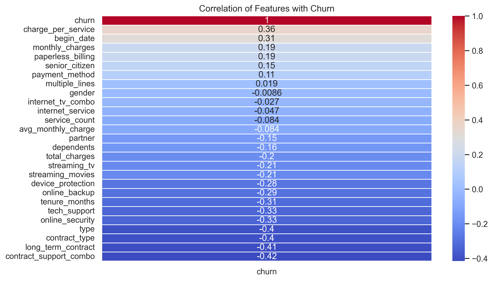

# 📉 Customer Churn Prediction for Telecom: Proactive Retention with Machine Learning

## 📌 Project Overview
This project focuses on building a predictive model to identify telecom customers at risk of churning. By analyzing user behavior, service preferences, and contract data, the model enables data-driven marketing strategies to reduce customer loss and improve retention.

---

## 🧠 Objective
Telecom company Interconnect seeks to reduce churn by identifying customers likely to cancel their service. By predicting churn and understanding the factors behind it, the company can proactively offer incentives, improve service, and personalize retention campaigns.

---

## 🔧 What Was Done (Methodology & Techniques)

- **Data Integration**: Merged multiple CSV files (`contract`, `internet`, `personal`, `phone`) using `customer_id` as a unique identifier.
- **Data Cleaning**: Standardized formats, dropped redundant fields, handled missing values, and encoded categorical variables.
- **Feature Engineering**: Created new features to capture customer tenure, service combinations, and billing behavior patterns.
- **Target Definition**: Labeled churn based on contract `EndDate` and created a binary target variable.
- **Modeling**: Trained and evaluated classification models:
  - Logistic Regression
  - Random Forest
  - XGBoost
  - LightGBM
- **Evaluation**:
  - Trained with stratified sampling and validated with test set
  - Assessed performance using **Accuracy**, **F1 Score**, **AUC-ROC**, and **Average Precision Score**

---

## 📊 Model Performance

| Metric          | Training Set | Test Set |
|-----------------|--------------|----------|
| Accuracy        | 0.93         | 0.88     |
| F1 Score        | 0.93         | 0.88     |
| ROC AUC Score   | 0.98         | 0.95     |
| Avg Precision   | 0.98         | 0.95     |

✅ The final model met the target threshold (F1 > 0.85) and demonstrated strong generalization without overfitting.

---

## 📈 Visual Example

*Figure: Heatmap showing top features correlated with customer churn.*

---

## ✅ Conclusion

The final LightGBM model effectively predicts churn with high precision and recall, enabling proactive customer engagement. Features like contract type, tech support usage, and billing behavior emerged as top indicators of churn.

---

## 🚀 Business Value & Next Steps

### Business Outcomes:
- 📉 Early churn detection for proactive outreach
- 📬 Improved targeting of incentives and personalized plans
- 💡 Strategic insights into customer behavior

### Future Improvements:
- Deploy the model as an API for integration into CRM tools
- Add behavioral and usage trend data for stronger signal
- Use SHAP or LIME for better interpretability in stakeholder reporting

## 📁 Repository Structure

├── final_provider # Raw data files
  └── contract.csv # contract information
  └── internet.csv # the client's personal data
  └── personal.csv # information about Internet services
  └── phone.csv # information about telephone services
├── README.md # Project documentation
├── finalproject1:3.ipynb # Jupyter notebook for project work plan
├──  finalproject2:3.ipynb # Jupyter notebook for churn modeling
├── finalproject3:3.ipynb # Jupyter notebook for project solution report
├── images # Visuals and charts
│ └── churn_feature_corr.png # Correlation heatmap or key plot

---

## 🛠️ Technologies Used

- **Python**, **Pandas**, **NumPy**
- **Scikit-learn**, **XGBoost**, **LightGBM**
- **Matplotlib**, **Seaborn**
- **Jupyter Notebook**

---

## 📬 Contact

Created by **Sabrina McField**  
📧 sabrinamcfield@example.com | [LinkedIn](https://www.linkedin.com/in/sabrinamcfield)
