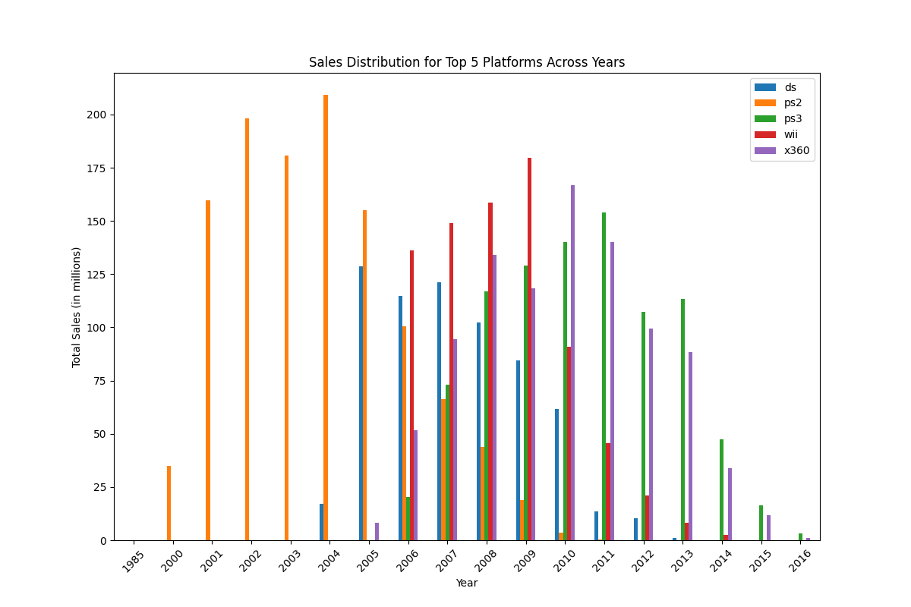
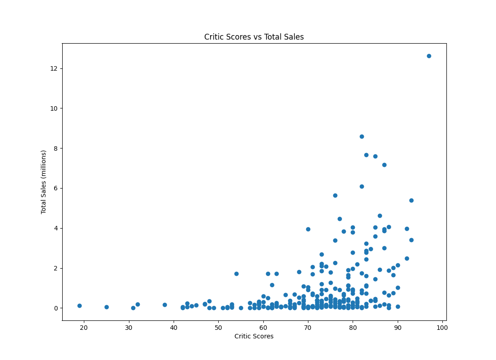

#  Online Game Store Marketing Analysis: Data-Driven Insights for Global Strategy

##  Project Overview
This project analyzes historical sales and review data from Ice, a global online video game retailer, to uncover which platforms, genres, and games are most profitable. The analysis aims to inform the company’s 2017 marketing strategy by identifying high-performing products and regional consumer preferences.

---

##  Objective
The goal was to forecast which game genres and platforms are likely to perform best in the global marketplace. By analyzing trends in sales, platform life cycles, regional preferences, and review scores, the project supports data-informed business decisions in the gaming industry.

---

##  What Was Done (Methodology & Techniques)

- **Data Cleaning & Preprocessing**:
  - Removed placeholder values (e.g., "TBD") in review columns.
  - Handled missing values in `year_of_release`, `user_score`, `critic_score`, and `rating`.
  - Converted data types and standardized column names.

- **Platform Lifecycle Analysis**:
  - Evaluated sales trends over time to identify the life span of popular platforms like PS3, X360, Wii, PS4, and XOne.
  - Found that platforms typically have ~10-year lifespans.

- **Genre Performance Evaluation**:
  - Identified Action, Sports, and Shooter as top global genres.
  - Puzzle, Fighting, and Strategy showed lower performance due to limited replay value.

- **Regional Sales Segmentation**:
  - North America: prefers Action, Shooter, Sports (dominant sales region).
  - Europe: similar preferences with additional interest in Racing games.
  - Japan: favors RPGs and handheld platforms like DS.

- **Review Score Impact**:
  - Critic scores had a strong positive correlation with sales.
  - User scores had a weaker correlation, suggesting critic reviews are more predictive of commercial success.

---

##  Visual Example

**Platform Lifecycle Trends**  

> *Figure: A vertical bar chart showing annual sales of the top 5 gaming platforms (DS, PS2, PS3, Wii, X360) from 1998 to 2016. The plot reveals that each platform experiences a distinct rise, peak, and decline pattern—highlighting typical 8–10 year life cycles that are crucial for forecasting product demand.*

**Genre Sales by Region**  

> *Figure: A grouped bar chart comparing game genre popularity across North America, Europe, and Japan. The Action and Shooter genres dominate in NA and EU, while Role-Playing Games (RPGs) are significantly more popular in Japan. These insights inform regional marketing and genre-specific investment strategies.*

**Critic Score vs. Global Sales**  

> *Figure: A scatter plot illustrating the relationship between critic scores and global game sales. The upward trend suggests a positive correlation: as critic scores increase, so do total sales. This validates the use of critic feedback as a predictive metric for commercial success.*

---

##  Conclusion

- **Top Platforms**: PS4, XOne, and 3DS remain strong; older consoles are declining.
- **Profitable Genres**: Action, Shooter, and Sports lead in sales; RPGs are especially strong in Japan.
- **Critical Impact**: Strong correlation between critic reviews and commercial success — reviews should be leveraged in marketing.
- **Data-Driven Strategy**: Recommendations support targeted platform investments, regional strategies, and review-based promotions.

---

##  Future Improvements
- Integrate marketing spend and ROI data
- Predict future bestsellers using machine learning
- Add real-time user engagement and social listening insights

---

##  Business Value
This analysis equips Ice’s marketing team with the insights needed to:
- Prioritize investments in the most profitable platforms and genres
- Tailor regional strategies based on consumer behavior
- Capitalize on the influence of critic reviews to enhance campaign performance

---

### Future Recommendations
- Incorporate live review feeds and current market data for real-time forecasting.
- Expand to mobile and indie game segments.
- Build an interactive dashboard for internal business use.

---

##  Repository Structure

├── IntegratedProject1.ipynb # Jupyter notebook with all analysis
├── data / # Cleaned dataset and original raw files
├── images/ # Visualizations used in README
│ └── game_sales_reviews_heatmap.png # Example correlation heatmap
├── README.md # Project documentation
└── requirements.txt # Python dependencies

---

##  Technologies Used

- **Python**, **pandas**, **NumPy**
- **matplotlib**, **seaborn**
- **Jupyter Notebook**

---

##  Contact

Created by **Sabrina McField**  
📧 sabrinamcfield@gmail.com | [LinkedIn](https://www.linkedin.com/in/sabrinamcfield)

---
