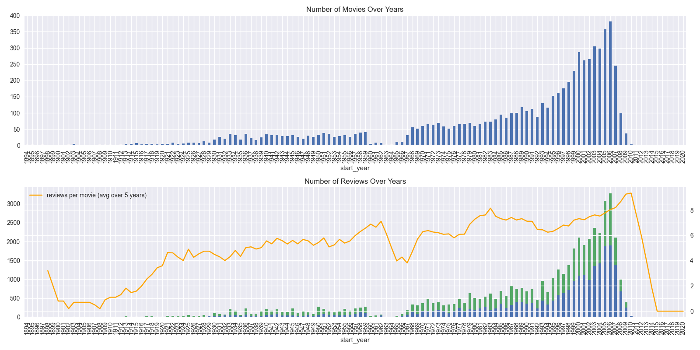
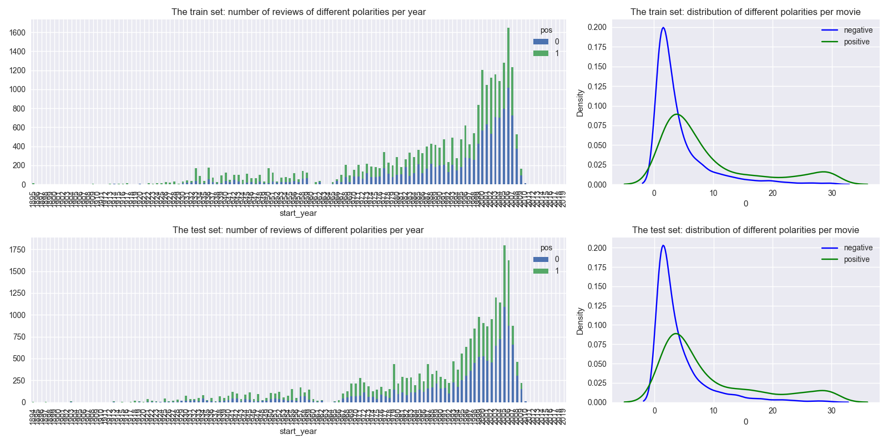
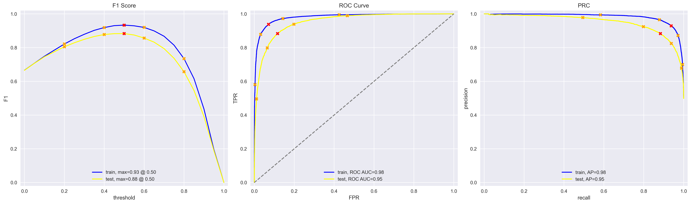

#  Sentiment Decoded: Predicting Movie Review Polarity with Text Classification

This project uses Natural Language Processing (NLP) to classify IMDb movie reviews as **positive or negative**. Built for the Film Junky Union, the goal was to automate review moderation by detecting negative sentiment with a high level of accuracy.

##  Objective

Develop a scalable machine learning model capable of accurately classifying movie reviews by sentiment, using a dataset of IMDB reviews and state-of-the-art text preprocessing techniques. The aim is to enhance content moderation, improve platform trust, and inform user engagement strategies.

---

##  Methodology

- Cleaned and explored IMDB `.tsv` review data, handling missing values and duplicates while preserving column types like `votes` using nullable integers.
- Performed exploratory data analysis to visualize trends in movie release years, sentiment distribution, and review volume.
- Preprocessed review text using two methods:
  - **NLTK-based normalization**
  - **spaCy-based lemmatization**
- Applied **TF-IDF vectorization** to transform text into machine-readable format.
- Trained and evaluated the following models:
  - Logistic Regression (baseline)
  - LightGBM (boosted tree)
- Tuned hyperparameters using `GridSearchCV` and `RandomizedSearchCV`.
- Evaluated with metrics including:
  - **F1 Score**
  - **Accuracy**
  - **ROC AUC**
  - **Average Precision Score (APS)**

---

##  Visual Examples

###  Movie Volume & Reviews by Release Year  
  
> Figure: Movie and Review Volume Trends Over Time

> The top chart illustrates the number of movies released each year, showing a steady increase starting in the 1980s and peaking in the early 2000s.

> The bottom chart visualizes the number of reviews per year, segmented by sentiment, alongside a smoothed orange line that represents the average number of reviews per movie (5-year rolling average). This dual-axis view reveals a significant rise in user review activity beginning in the 1990s, with the highest engagement observed for films released in the 2000s.
These trends highlight how modern releases receive more public feedback, suggesting stronger user engagement and more abundant training data for sentiment models.*

---

###  Sentiment Distribution by Year  
  
> Figure: Sentiment Distribution by Year 

> This visual compares sentiment polarity in both training and test sets.

> * The bar plots on the left display the number of positive and negative reviews distributed by movie release year. There's a noticeable surge in review volume post-2000, with positive reviews generally outnumbering negatives.

> * The KDE plots on the right illustrate the distribution of sentiment polarity per movie. In both train and test sets, most movies receive fewer than 10 reviews, with a slightly higher concentration of negative reviews for movies with minimal feedback.

> These plots confirm that the dataset is imbalanced in review volume across years and sentiment, helping to inform model evaluation and data preprocessing strategies.*

---

###  Evaluation Metrics for Sentiment Classification Model 
  
> *Figure: Evaluation Metrics for Sentiment Classification Model

> This visual presents three key performance plots comparing training and test results for the logistic regression classifier.

> * The F1 Score vs. Threshold plot shows that both datasets reach peak performance at a threshold of 0.5, with the model achieving an F1 score of 0.93 on training data and 0.88 on test data.

> * The ROC Curve illustrates strong discriminatory ability, with AUC values of 0.98 (train) and 0.95 (test), indicating a low false-positive rate.

> * The Precision-Recall Curve (PRC) confirms reliable model performance across varying recall levels, achieving average precision (APS) scores of 0.98 and 0.95 on train and test sets respectively.

> These results reflect a well-calibrated model with high generalization and minimal overfitting..*

---

##  Results

- The best model used **spaCy + TF-IDF + Logistic Regression**, achieving:
  - **F1 Score**: 0.93 (train), 0.88 (test)
  - **Accuracy**: 93% (train), 88% (test)
  - **ROC AUC**: 0.95
  - **APS**: 0.95
- Strong generalization performance with balanced precision and recall.
- Model predictions aligned well with sentiment tone, even in nuanced reviews.

---

##  Business Value & Future Improvements

This solution enables scalable and automatic sentiment classification, which adds value in several areas:

-  **Business Value**:
    - Enhances moderation for platforms with high user-generated content.
    - Supports real-time analysis of public reception for new media releases.
    - Enables sentiment tagging for better recommendation engines and trend detection.

-  **Future Improvements**:
    - Expand to multi-class sentiment (e.g., neutral, mixed).
    - Incorporate deep learning models like BERT for improved language understanding.
    - Deploy the model using a Streamlit dashboard or REST API for live review analysis.
    - Integrate SHAP/LIME for explainable AI in enterprise use cases.

---

##  Technologies Used

- Python
- Pandas, NumPy, Seaborn, Matplotlib
- NLTK, spaCy
- scikit-learn
- LightGBM
- Jupyter Notebook

---

##  Next Steps

- Train on broader datasets including user metadata and review topics.
- Develop a feedback loop to continuously retrain the model with fresh reviews.
- Integrate into streaming services or e-commerce platforms as a plug-and-play module.

---

## Repository Structure

├── images   # Visualizations used in README

│   └── movie_volume_by_year.png      # Bar chart of movie release volume and review frequency by year

│   └── sentiment_distribution.png    # Distribution of sentiment polarities across training and test sets

│   └── prediction_samples.png        # Sample predictions with their sentiment probabilities

├── MachineLearningForTextsProject.ipynb   # Jupyter notebook with all analysis

├── README.md   # Project documentation

├── imdb_reviews.tsv   # Cleaned dataset and original raw files

---

##  Contact

Created by **Sabrina McField**  
sabrinamcfield@gmail.com | [LinkedIn](https://www.linkedin.com/in/sabrinamcfield)

