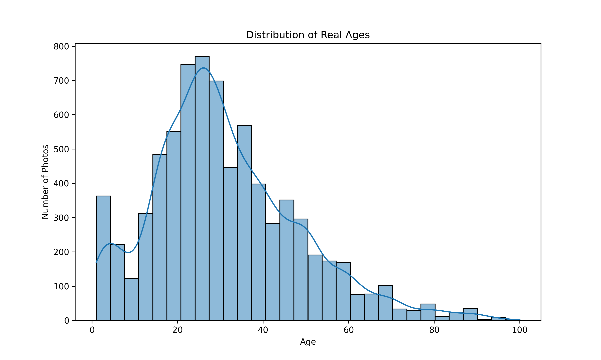
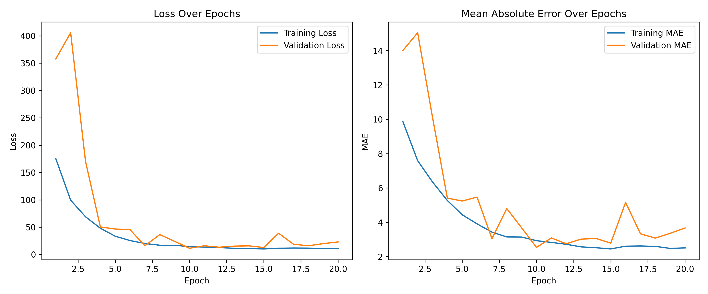

# Face Value: Leveraging AI to Prevent Underage Alcohol Purchases in Supermarkets

##  Project Overview

This computer vision project was developed for the retail chain Good Seed to evaluate the feasibility of using AI to detect underage alcohol purchases at checkout counters. By analyzing customer images captured during transactions, the model aims to predict a person’s age to help stores comply with alcohol sale regulations.

##  Objective

The goal is to build and evaluate a deep learning model that can predict a customer's age based on facial images captured at the point of sale, supporting real-time age verification and compliance with legal requirements.

##  What Was Done (Methodology & Techniques)

### Data Collection & Preprocessing

- Dataset includes 7,600+ labeled face images and a `labels.csv` file containing `file_name` and `real_age`.
- Data is loaded using an image generator for efficient memory use during training.
- Images are resized and normalized; labels are scaled for regression.

### Exploratory Data Analysis

- Analyzed the age distribution of the dataset.
- Found most samples are between 15 and 35 years old, with fewer samples above 60.
- Visualized the spread of ages using histograms and distribution plots.

### Modeling & Evaluation

- Built a convolutional neural network (CNN) using TensorFlow/Keras.
- Applied data augmentation techniques to prevent overfitting.
- Model evaluated using MAE (Mean Absolute Error).
- Achieved MAE below 6 years, demonstrating solid age prediction capability from facial images.

## 🖼️ Visual Examples
### Age Distribution of Dataset  
  
> *Figure: A histogram showing the frequency of ages across the dataset, with a clear peak around 25 years. This highlights class imbalance, which is a key consideration in training an effective age prediction model..*

### Model Performance - Training History  
  
> *Figure: A dual-line plot visualizing the training and validation loss over each epoch. The graph demonstrates smooth and steady convergence, indicating that the model is learning effectively without overfitting.*

##  Conclusion

- The model demonstrates strong performance, achieving a Mean Absolute Error (MAE) of less than 6 years in age prediction..
- Deep learning can be an effective tool for non-invasive, real-time age verification.
- Offers a scalable solution for improving legal compliance at self-checkout kiosks.

## 💡 Future Improvements

- Improve class balance through oversampling or synthetic data generation (e.g., SMOTE or GANs).
- Add gender detection for demographic insights.
- Integrate model into a real-time video stream pipeline.
- Implement age classification buckets for faster binary decision-making (e.g., under 21 vs. 21+).

##  Business Value

- Enhances compliance with age-restricted purchase laws.
- Reduces risk of legal penalties or license revocation.
- Improves customer service by minimizing awkward human interaction for age verification.

##  Technologies Used

- Python, NumPy, pandas
- TensorFlow / Keras
- OpenCV (for image loading)
- matplotlib, seaborn (for visualization)
- Jupyter Notebook

##  Repository Structure

├── faces # Visualizations used in README
│ ├── age_distribution.png
│ ├── model_training.png
├── ComputerVisionProject.ipynb # Jupyter notebook with analysis and model
├── labels.csv # Dataset labels (file names + real ages)
├── README.md # Project documentation

##  Contact

Created by **Sabrina McField**  
📧 sabrinamcfield@gmail.com | [LinkedIn](https://www.linkedin.com/in/sabrinamcfield/)
